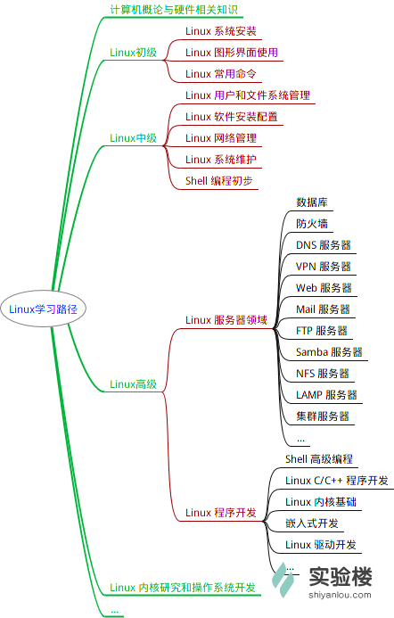
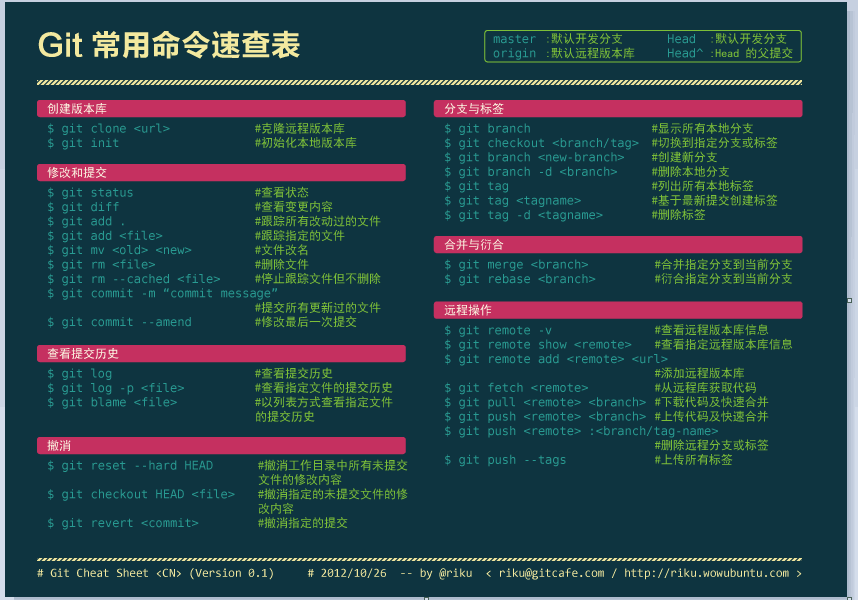

# 玩转实验楼

_write by @汪德成_

> [实验楼](www.shiyanlou.com)是一个程序员在线实训平台，，为学生及在职程序员提供编程、运维、测试、云计算、大数据、数据库等当前主流IT技术实践课程。本文旨在帮助新接触的朋友更快的熟悉实验楼的使用环境，本文将依照学习顺序向新手介绍该网站的一些基本的课程。实验楼本身也提供了优秀的学习路径说明，本文主要参照自己的学习经历和 [_Linux研发工程师_](https://www.shiyanlou.com/paths/linuxdev) 这一学习路径展开。更多的学习路径请参考<https://www.shiyanlou.com/paths/>。值得注意的是，实验楼只是提供一个实验平台，实验楼上的课程也偏重于实践，如果需要更加深入的学习相关知识，应该查找相关的资料并阅读相关的书籍，在掌握一定基础知识下进行实验才能事半功倍。

## 1.实验楼基本环境介绍

首先登录[实验楼网站](www.shiyanlou.com)注册一个账户，登录账户后就可以开始进行免费课程的学习，实验楼提供的免费课程相对比较丰富，很适合新手入门，更加深入的课程需要付费学习。

然后进入 _我的主页_ ，在该页可以看到正在学习和已经完成的课程，实验楼还提供时间轴，用户可以随时查看学习记录。

实验楼的等级被称作“楼”，主要根据在实验楼的学习时间而定，需要注意的是 _有效学习时间_ 需要你使用编程环境才能被计算在内。

## 2.[新手之玩转实验楼](https://www.shiyanlou.com/courses/63)

这个课程是实验楼提供的入门指导课程，建议首先学习该课程，以便熟悉实验楼的系统和实验流程。

实验由两个小实验组成，首先加入该课程，点击 _开始实验_ 后进入一小段指引，接下来就是实验界面，左侧是实验文档，右侧是实验桌面环境。有的实验只提供字符界面，不提供图形界面，此时只能使用命令行模式，你也可以在最右侧功能栏点击 _切换界面_ 主动切换至字符界面。

在左侧页面上方点击实验报告可以在实验过程中填写实验报告，实验报告以 markdown 的格式保存，关于markdown的语法参考[Markdown 中文网站](http://www.markdown.cn/)。

## 3. [Linux 基础入门（新版）](https://www.shiyanlou.com/courses/1)

实验楼提供的 Linux 基础课程，介绍了一些基本的概念和快捷键，对于 Linux 系统没有进行深入的讲解，建议在学习课程时参阅书籍[《鸟哥的Linux私房菜》](http://linux.vbird.org/linux_basic/)

在本课程完成以后，应当根据需要进一步的学习 Linux 的相关知识，下面基本的学习路线帮助你了解进一步的学习方向

如果你对操作系统没有概念，可以参阅[《深入理解计算机系统》](https://book.douban.com/subject/1230413/)，这本书从计算机底层讲起，对整个计算机系统有比较全面的介绍。

## 4. [Vim编辑器](https://www.shiyanlou.com/courses/2)

从Vi演生出来的Vim具有多种模式，这种独特的设计容易使初学者产生混淆。Vim 和 Vi 一样，仅仅通过键盘来在这些模式之中切换。这就使得 Vim 可以不用进行菜单或者鼠标操作，并且最小化组合键的操作。由于功能强大而体量较小，Vim 编辑器被包含在基本上所有的Linux 发行版中，其扮演相当于 Windows 平台下的记事本的角色，而其功能却强大的多。

主流编辑器学习曲线，横轴是熟练程度，纵轴是技能。学习使用 Vim 的前期是十分困难的，需要熟悉 Vim 复杂的工作模式和庞杂的快捷键系统，而熟练掌握后 Vim 的使用效率非常高。

基本上 vi/vim 共分为三种模式，分别是命令模式（Command mode），输入模式（Insert mode）和底线命令模式（Last line mode）。在这三种模式下进行切换如下图：

Vim 所有操作都使用键盘实现，因此有比较复杂的快捷键系统，详细的快捷键键位可以参考下图：

关于Vim的另一个比较详细的教程参考：<http://www.runoob.com/w3cnote/all-vim-cheatsheat.html>

## 5. [Git 实战教程](https://www.shiyanlou.com/courses/4)

Git 是一种使用广泛的分布式版本控制系统，每一个用户在本地保存完整的文件历史信息，修改的文件以快照的方式存储，Git 的绝大部分操作都是在本地执行，使得速度非常的快。Git 使用校验算法计算文件的指纹信息，以保证文件传输的准确和对修改的识别，可以防止文件重复保存。Git 的多数操作只是添加文件，如果养成定期 `push` 到远程仓库的习惯，基本不用担心数据的丢失。

Git 是一种分布式版本控制系统

Git 工作流程

对于任何一个文件，在 Git 内都只有三种状态：已提交（_committed_），已修改（_modified_）和已暂存（_staged_）。

Git命令速查：

Git的详细介绍以及高级特性可以参见[Pro Git book](https://git-scm.com/book/zh/v2)

## 6. [深入学习](https://www.shiyanlou.com/paths/linuxdev)

学习完上面的课程，已经能够基本熟悉 Linux 系统的操作和实验楼的使用环境。可以进一步阅读资料并在实验楼平台上进行实践，或者在实验楼上学习需要的课程。

### [高级bash脚本编程指南](https://www.shiyanlou.com/courses/944)

Bash（GNU Bourne-Again Shell）是一个为GNU计划编写的Unix shell，它是许多Linux平台默认使用的shell。shell是一个命令解释器，是介于操作系统内核与用户之间的一个绝缘层。准确地说，它也是能力很强的计算机语言，被称为解释性语言或脚本语言。它可以通过将系统调用、公共程序、工具和编译过的二进制程序”粘合“在一起来建立应用，这是大多数脚本语言的共同特征，所以有时候脚本语言又叫做“胶水语言”
事实上，所有的UNIX命令和工具再加上公共程序，对于shell脚本来说，都是可调用的。Shell脚本对于管理系统任务和其它的重复工作的例程来说，表现的非常好，根本不需要那些华而不实的成熟紧凑的编译型程序语言。

参考：

> [《高级bash脚本编程指南》](http://vdisk.weibo.com/s/aGfNhFvk17yf6)

### [Linux系统编程](https://www.shiyanlou.com/courses/24)

>本课程是基于杨铸所著《Linux下C语言应用编程》制作的。主要讲解了 Linux 下的编程体验，并且涉及文件IO以及多进程等等。

参考：

> [《高级 Linux 程序设计》](http://vdisk.weibo.com/s/dhtjgjoJyibce)

### [Makefile](https://www.shiyanlou.com/courses/849)

什么是 makefile？或许很多 Winodws 的程序员都不知道这个东西，因为那些 Windows 的 IDE 都为你做了这个工作，但我觉得要作一个好的和 professional 的程序员，makefile 还是要懂。特别在Unix下的软件编译，你就不能不自己写 makefile 了，会不会写 makefile，从一个侧面说明了一个人是否具备完成大型工程的能力。因为，makefile 关系到了整个工程的编译规则。一个工程中的源文件不计数，其按类型、功能、模块分别放在若干个目录中，makefile 定义了一系列的规则来指定，哪些文件需要先编译，哪些文件需要后编译，哪些文件需要重新编译，甚至于进行更复杂的功能操作，因为 makefile 就像一个 Shell 脚本一样，其中也可以执行操作系统的命令。makefile 带来的好处就是——“自动化编译”，一旦写好，只需要一个make命令，整个工程完全自动编译，极大的提高了软件开发的效率。

参考：
>[《Gun make 中文手册》](http://vdisk.weibo.com/s/avOeQVGe0iEFi)
>[Makefile经典教程(掌握这些足够)](https://yq.aliyun.com/articles/9243)

### [Go语言编程](https://www.shiyanlou.com/courses/11)

### [数据结构(新版)](https://www.shiyanlou.com/courses/20)

## 附1. 在个人电脑上安装 Linux 发行版

实验楼虽然提供完整的 Linux 使用环境，但是普通用户无法保存数据，也无法连接外网，很多功能可能无法实现，建议在你的电脑上安装一个 Linux 的发行版。可以选择安装双系统或者使用虚拟机。基于 Linux 内核的发行版有很多，常用的是 CentOS 和 Ubuntu，很多互联网公司喜欢用 CentOS，个人用户则更倾向于用 Ubuntu（Ubuntu kylin 团队移植了很多常用的软件，使得 Ubuntu 更加易用）。可以参阅：

>* [VirtualBox安装部署Ubuntu 16.04 图文详解](http://www.linuxidc.com/Linux/2016-08/134580.htm)（虚拟机）
>* [Win10和Ubuntu16.04双系统安装详解](https://www.jianshu.com/p/16b36b912b02)（双系统）
