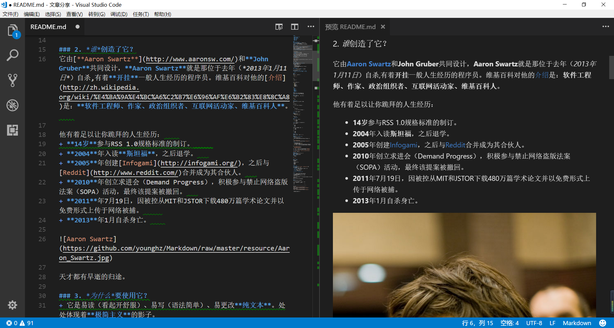
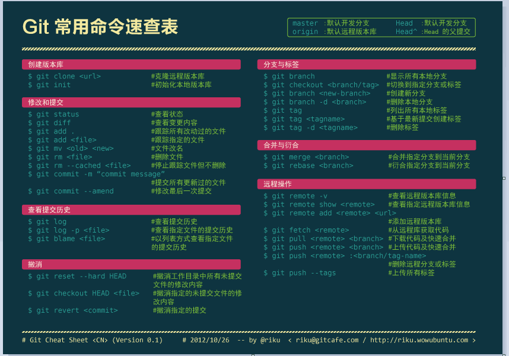
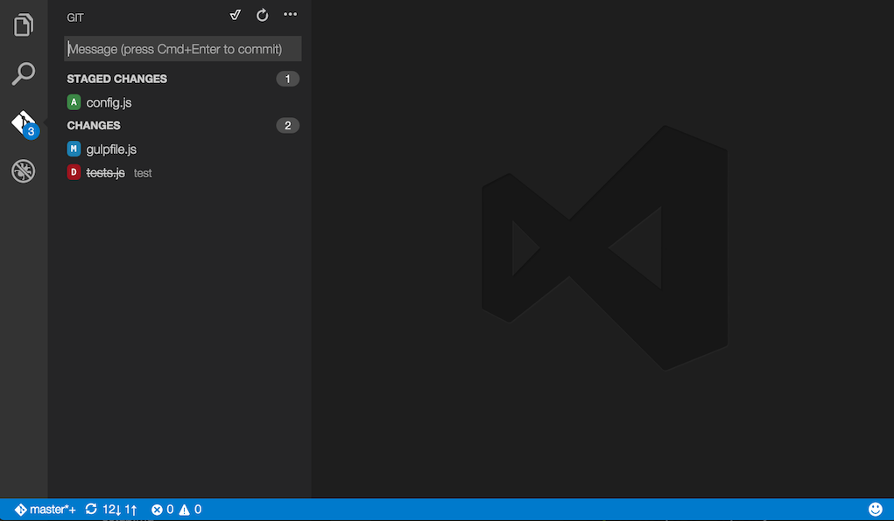
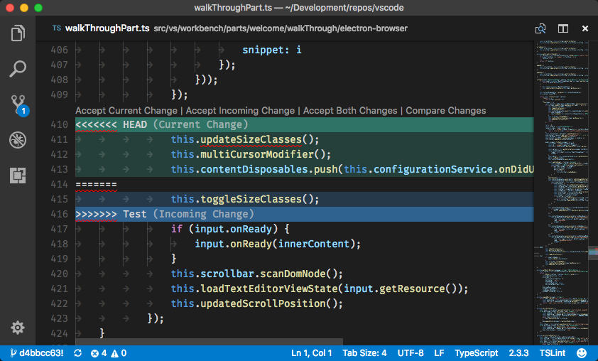
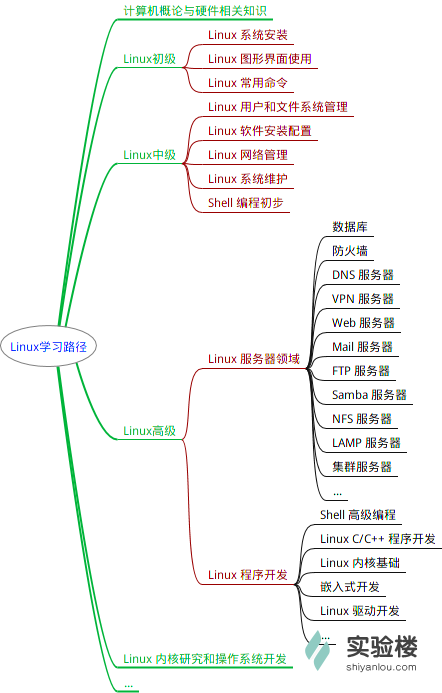
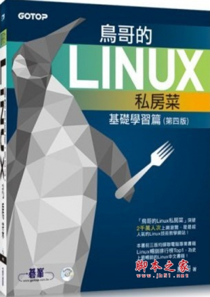

导语：
>本文是一篇学习笔记，总结了一些时下比较流行的技术，并介绍了一些相关的工具。本文部分内容整理自互联网，相关文章连接均在每一节进行标注。由于作者水平有限，不可避免有一些错误，如在阅读中发现错误可发送邮件至<wdc1994@foxmail.com>指正。

## 1. Markdown

### Markdown介绍

什么是markdown？Markdown是一种可以使用普通文本编辑器编写的标记语言，通过简单的标记语法，它可以使普通文本内容具有一定的格式。Markdown 的语法全由一些符号所组成，这些符号的作用一目了然，因此使用Markdown格式撰写的文件可以直接以纯文本的方式发布。

Markdown语法通过一些简单的符号能够实现基本的格式控制，如常见的斜体粗体，区块引用，插图，代码引用，标题，超链接甚至是表格等。如Markdown中在行开头使用‘#’可以实现多级标题，使用‘<’可以实现区块引用，在段前加上table符实现代码区块，能够以十分便利的方式写出美观的文档。

MarkDwon的语法十分简洁，只需要花上十几分钟就能基本熟悉Markdown的基本语法。Markdown文件以‘.md’作为文件后缀名，如“READEME.md”文件被广泛的用于软件说明文档。Markdown文件还可以通过一些工具转换成pdf、word等格式的文档，本文即是使用Markdown语法写成。

### Markdown常用编辑器

Markdown的编写其实不局限于某种编辑器，甚至通过notepad都可以写出可用的Markdown文档，不过很多专用的工具提供丰富的实用功能帮助作者写出美观的Markdown文档。有些工具能够提供实时预览的功能使作者能够直观的看出所编写的文档最后将以什么样的外观展示在读者眼前，便于实时修改以达到理想的效果。还有一些工具提供格式控制功能，用于帮助作者规范创作格式。笔者现在使用微软提供的免费软件Visual Studio Code，安装[Auto-Open Markdown Preview](https://marketplace.visualstudio.com/items?itemName=hnw.vscode-auto-open-markdown-preview)插件能够实现实时预览，使用[markdownlint](https://marketplace.visualstudio.com/items?itemName=DavidAnson.vscode-markdownlint)插件实现格式提示。

根据[Markdown中文网站](http://www.markdown.cn/)的提示，在各种不同的平台下常用的免费编辑器如下：

Windows 平台

>* MarkdownPad
>* MarkPad

Linux 平台

>* ReText

Mac 平台

>* Mou

在线编辑器

>* Markable.in
>* Dillinger.io

浏览器插件

>* MaDe (Chrome)

高级应用(Sublime Text 2 + MarkdownEditing 教程)

>* Sublime Text 2
>* [MarkdownEditing](http://ttscoff.github.io/MarkdownEditing/)
>* [教程](https://lucifr.com/2012/07/12/markdownediting-for-sublime-text-2/)

### 参见：

* [Markdown 语法说明 (简体中文版)](http://wowubuntu.com/markdown/)
* [Markdown: Basics (快速入门)](http://wowubuntu.com/markdown/basic.html)
* [Markdown 中文网站](http://www.markdown.cn/)

## 2. 版本控制系统

版本控制系统是一种记录一个或若干文件内容变化，以便将来查阅特定版本修订情况的系统。有了它你就可以将某个文件回溯到之前的状态，甚至将整个项目都回退到过去某个时间点的状态。你可以比较文件的变化细节，查出最后是谁修改了哪个地方，从而找出导致怪异问题出现的原因，又是谁在何时报告了某个功能缺陷等等。使用版本控制系统通常还意味着，就算你乱来一气把整个项目中的文件改的改删的删，你也照样可以轻松恢复到原先的样子，但额外增加的工作量却微乎其微。现在常用的版本控制系统主要分为集中式和分布式两种。

集中式版本控制系统：
>集中式版本控制系统有一个单一的集中管理的服务器，保存所有文件的修订版本，而协同工作的人们都通过客户端连到这台服务器，取出最新的文件或者提交更新。

这种做法的好处是每个用户都可以在一定程度上看到项目中的其它人在做什么，管理员也可以掌握每个开发者的权限。但是带来的问题是服务器的压力会很大，而且一旦服务端或者网络连接出现故障就无法协同工作，备份不及时还会造成数据的损失。

分布式版本控制系统：
>分布式管理系统中，客户端会克隆整个代码仓库，这样以来就可以利用任何一个客户端的数据来恢复整个项目，相当的安全。分布式的版本控制系统还可以指定连接到一个或多个远程代码仓库，这样以来一个项目可以分别和不同的工作小组相互协作，实现不同的协作流程。

### Git和Github

Git 是一种使用广泛的分布式版本控制系统，每一个用户在本地保存完整的文件历史信息，修改的文件以快照的方式存储，Git 的绝大部分操作都是在本地执行，使得速度非常的快。Git 使用校验算法计算文件的指纹信息，以保证文件传输的准确和对修改的识别，可以防止文件重复保存。Git 的多数操作只是添加文件，如果养成定期 `push` 到远程仓库的习惯，基本不用担心数据的丢失。

对于任何一个文件，在 Git 内都只有三种状态：已提交（_committed_），已修改（_modified_）和已暂存（_staged_）。已提交表示该文件已经被安全地保存在本地数据库中了；已修改表示修改了某个文件，但还没有提交保存；已暂存表示把已修改的文件放在下次提交时要保存的清单中。由此我们看到 Git 管理项目时，文件流转的三个工作区域：Git 的工作目录，暂存区域，以及本地仓库。

Git的详细使用可以参见[Pro Git book](https://git-scm.com/book/zh/v2)，读者也可以在实验楼网站上参加[_Git实战教程_](https://www.shiyanlou.com/courses/4)进行实践。

Git命令速查：

以上介绍的是Git的本地特性，使用上面的特性可以完成日常工作，然而，如果想与他人合作，还需要一个远程的 Git 仓库，这种仓库一般被称为 **Git服务器**。通过建立Git服务器可以在项目合作者之间共享仓库，从那里推送和拉取数据。建立Git仓库只需要很少的资源，详细的过程可以参见——[Chapter 4 服务器上的 Git](https://git-scm.com/book/zh/v1/%E6%9C%8D%E5%8A%A1%E5%99%A8%E4%B8%8A%E7%9A%84-Git)。

特别的，GitHub 一个提供远程 Git 仓库的代码托管网站，也是目前为止最大的开源 Git 托管服务提供者，并且还是少数同时提供公共代码和私有代码托管服务的站点之一，所以你可以在上面同时保存开源和商业代码，但私有仓库需要付费使用。

现在很多编辑器均提供 Git 管理工具，以 Visual Studio Code 为例，除了软件自带的完整 Git 工具，还可以使用插件实现更加丰富实用的功能，详细可参阅[_Using Version Control in VS Code_](https://code.visualstudio.com/docs/editor/versioncontrol).

参见：

* [Pro Git book](https://git-scm.com/book/zh/v2)
* [实验楼-Git实战教程](https://www.shiyanlou.com/courses/4)
* [Using Version Control in VS Code](https://code.visualstudio.com/docs/editor/versioncontrol)
* [Git For Designers](http://blog.teamtreehouse.com/git-for-designers-part-1)
* [git - the simple guide](http://rogerdudler.github.io/git-guide/)
* [GitHub: the beginner's guide](https://www.pluralsight.com/blog/software-development/github-tutorial)

## 3. Linux 及相关工具

Linux 是一套免费使用和自由传播的类Unix操作系统，是一个基于 POSIX 和 UNIX 的多用户、多任务、支持多线程和多CPU的操作系统。由于其开源特性， Linux 可以轻易的被裁剪、修改以适配到各种硬件平台和各种使用场景，搭建一个 Linux 硬件平台的成本甚至可以低至100多元（典型的如树莓派）。由于 Linux 下专业的软件支持较少，很多软件都是由志愿者开发，易用性可能不如 Windows 平台下的软件，Linux 程序员必须学会使用很多命令和相关的工具才能高效的使用Linux。

### Linux 学习路线

首先你需要明确学习 Linux 的目的，下面这张学习路线可能可以帮到你：

首先应该学习初级和中级的知识，进一步的根据自己的需要深入学习一个方向。对于初学者来说可以学习**实验楼**上的课程————[_Linux 基础入门（新版）_](https://www.shiyanlou.com/courses/1)初步了解 Linux 系统的使用。

但这个课程只是教你一些基础的命令和工具，你应该阅读一些关于 Linux 系统的书籍以加深对 Linux 系统的认识，更进一步的你可以阅读一些操作系统相关的书籍来学习相关的内容和概念。推荐

[深入理解计算机系统](https://book.douban.com/subject/1230413/)

[鸟哥的Linux私房菜](http://linux.vbird.org/linux_basic/)

建议在你的电脑上安装一个 Linux 的发行版，可以安装双系统或者使用虚拟机。基于 Linux 内核的发行版有很多，常用的是 CentOS 和 Ubuntu，很多互联网公司喜欢用 CentOS，个人用户则更倾向于用 Ubuntu（Ubuntu kylin 团队移植了很多常用的软件，使得 Ubuntu 更加易用）。可以参阅：

>* [VirtualBox安装部署Ubuntu 16.04 图文详解](http://www.linuxidc.com/Linux/2016-08/134580.htm)
>* [Win10和Ubuntu16.04双系统安装详解](https://www.jianshu.com/p/16b36b912b02)

## 4.常用工具

### Visual Studio Code

### vi/vim

### jetbrains全家桶

## 附章

关于新手在实验楼上课程的选择和顺序，推荐：

>1. [新手指南之玩转实验楼](https://www.shiyanlou.com/courses/63)
>2. [Linux 基础入门（新版）](https://www.shiyanlou.com/courses/1)
>3. [Vim编辑器](https://www.shiyanlou.com/courses/2)
>4. [高级bash脚本编程指南](https://www.shiyanlou.com/courses/944)
>5. [Git 实战教程](https://www.shiyanlou.com/courses/4)

实验楼上还有更多丰富的内容可自行发掘